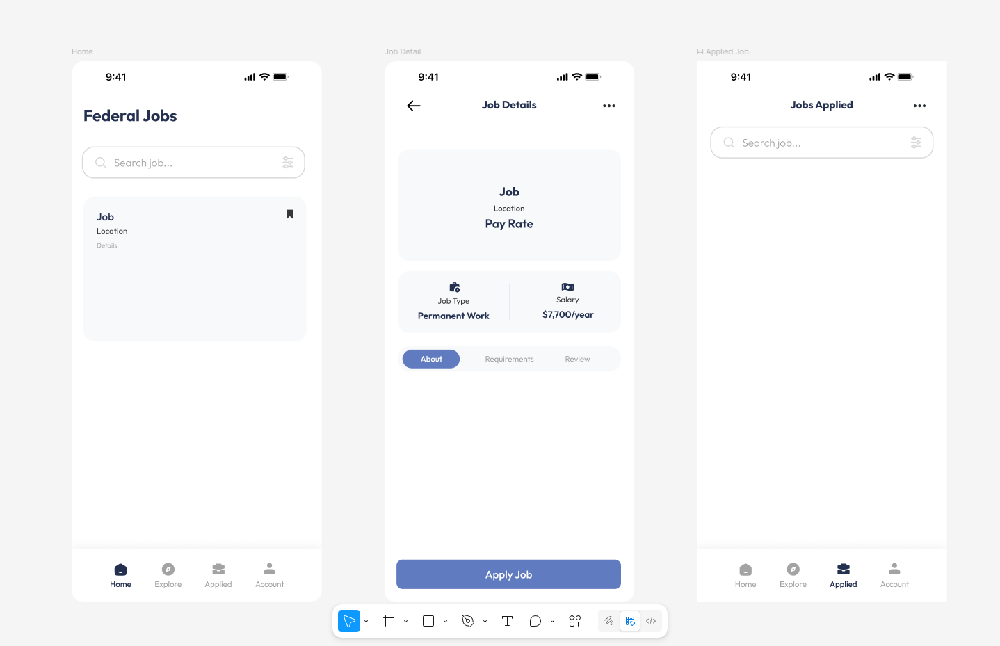

# Federal Job Finder

## Table of Contents

1. [Overview](#Overview)
2. [Product Spec](#Product-Spec)
3. [Wireframes](#Wireframes)
4. [Schema](#Schema)

## Overview

### Description

Federal Job Finder is an iOS application that provides users with a streamlined way to search, discover, and track federal government job opportunities through the USAJobs API. The app focuses on delivering a clean, modern user experience that makes finding and applying for federal positions more accessible and efficient than the traditional USAJobs website.

### App Evaluation

- **Category:** Productivity / Career
- **Mobile:** Mobile-first design with offline capabilities, push notifications for job alerts, and location-based job search
- **Story:** Simplifies the federal job search process by providing a modern, intuitive interface to browse USAJobs opportunities
- **Market:** Job seekers interested in federal employment, government contractors, and career changers
- **Habit:** Users check daily for new job postings, set up saved searches with notifications, and track application deadlines
- **Scope:** Well-defined scope focusing on job search, favorites, saved searches, and application tracking with USAJobs API integration

## Product Spec

### 1. User Stories (Required and Optional)

**Required Must-have Stories**

* As a job seeker, I want to search for federal jobs using various filters, so that I can find positions that match my qualifications and preferences
* As a job seeker, I want to view detailed job information, so that I can understand the position requirements and application process
* As a job seeker, I want to save interesting job postings, so that I can review them later and track my application progress
* As a job seeker, I want to set up saved searches with notifications, so that I can be alerted when new positions matching my criteria are posted
* As a job seeker, I want to track application deadlines and status, so that I don't miss important dates and can manage my application pipeline

**Optional Nice-to-have Stories**

* As a job seeker, I want to access job information offline, so that I can review positions even without internet connectivity
* As a job seeker, I want the app to have an intuitive and accessible interface, so that I can efficiently navigate and use all features
* As a user, I want to receive push notifications for application deadlines and new job matches
* As a user, I want to share job postings with others via social media or messaging

### 2. Screen Archetypes

1. Job Search Screen
	* Search for federal jobs using filters (keywords, location, department, salary)
	* View search results in a list format
	* Apply filters and sorting options

2. Job Detail Screen
	* View detailed job information including requirements and application process
	* Save job to favorites
	* Navigate to USAJobs.gov to apply

3. Favorites Screen
	* View all saved favorite jobs
	* Remove jobs from favorites
	* Check job status (active/expired)

4. Saved Searches Screen
	* Create and manage saved search criteria
	* View new job matches for saved searches
	* Enable/disable notifications for searches

5. Applications Tracker Screen
	* Track application status and deadlines
	* View application timeline
	* Receive deadline reminders

### 3. Navigation

**Tab Navigation** (Tab to Screen)

* Search - Job Search Screen
* Favorites - Favorites Screen  
* Saved - Saved Searches Screen
* Applications - Applications Tracker Screen

**Flow Navigation** (Screen to Screen)

1. Job Search Screen
	* Navigate to Job Detail Screen when job is tapped
	* Navigate to Filter View for advanced search options
	* Navigate to Saved Searches to create new saved search

2. Job Detail Screen
	* Navigate back to Job Search Screen
	* Navigate to external USAJobs.gov for application
	* Navigate to Applications Tracker when marking as applied

3. Favorites Screen
	* Navigate to Job Detail Screen when favorite job is tapped
	* Navigate back to previous screen

4. Saved Searches Screen
	* Navigate to Job Search Screen with applied search criteria
	* Navigate to edit sheet for modifying saved searches

5. Applications Tracker Screen
	* Navigate to Job Detail Screen when application is tapped
	* Navigate to edit sheet for updating application status

### [BONUS] Digital Wireframes & Mockups

## Schema 

### Models

#### Job (Core Data Entity)

| Property | Type | Description |
|----------|------|-------------|
| jobId | String | Unique identifier from USAJobs API (PositionID) |
| title | String | Job position title |
| department | String | Federal department/agency name |
| location | String | Primary job location display |
| salaryMin | Int32 | Minimum salary range |
| salaryMax | Int32 | Maximum salary range |
| gradeDisplay | String | Job grade (e.g., GS-11, GS-12) |
| applicationDeadline | Date | Application closing date |
| applicationUri | String | URL to apply on USAJobs.gov |
| datePosted | Date | Job posting publication date |
| isFavorited | Boolean | Whether user has favorited this job |
| isRemoteEligible | Boolean | Whether job allows remote work |
| majorDutiesText | String | Formatted major duties description |
| keyRequirementsText | String | Formatted key requirements |
| cachedAt | Date | Timestamp when job was cached locally |

#### SavedSearch (Core Data Entity)

| Property | Type | Description |
|----------|------|-------------|
| searchId | UUID | Unique identifier for saved search |
| name | String | User-defined name for the search |
| keywords | String | Search keywords |
| location | String | Location filter |
| department | String | Department/agency filter |
| salaryMin | Int32 | Minimum salary filter |
| salaryMax | Int32 | Maximum salary filter |
| isNotificationEnabled | Boolean | Whether to send notifications for new matches |
| lastChecked | Date | Last time search was executed |

#### ApplicationTracking (Core Data Entity)

| Property | Type | Description |
|----------|------|-------------|
| jobId | String | Reference to Job entity (PositionID) |
| status | String | Application status (applied, under_review, interviewed, offered, rejected, withdrawn) |
| applicationDate | Date | Date when application was submitted |
| notes | String | User notes about the application |
| reminderDate | Date | Optional reminder date for follow-up |

#### SearchCriteria (Struct)

| Property | Type | Description |
|----------|------|-------------|
| keyword | String? | Search keyword |
| location | String? | Location filter |
| department | String? | Department filter |
| salaryMin | Int? | Minimum salary filter |
| salaryMax | Int? | Maximum salary filter |
| page | Int | Current page number for pagination |
| resultsPerPage | Int | Number of results per page (default: 25) |
| remoteOnly | Boolean | Filter for remote-eligible jobs only |

#### API Response Models

**JobSearchResponse** - Root response from USAJobs API
- `searchResult`: SearchResult object containing items and metadata

**SearchResult** - Container for search results
- `searchResultItems`: Array of JobSearchItem
- `searchResultCount`: Number of results in current page
- `searchResultCountAll`: Total number of matching jobs

**JobSearchItem** - Individual job in search results
- `matchedObjectId`: Job identifier
- `matchedObjectDescriptor`: JobDescriptor with full job details
- `relevanceRank`: Search relevance score

**JobDescriptor** - Complete job information from API
- Contains all job details including position info, location, salary, requirements, and application details
- Maps to Job entity for local storage

### Networking

**Base URL:** `https://data.usajobs.gov/api`

**Important API Usage Notes:**
- The USAJobs API is provided for **educational and non-commercial use only**
- Commercial use requires special permission from USAJobs
- API keys are free for educational purposes
- Please respect rate limits and terms of service

**How to Request API Access:**
1. Visit the [USAJobs API Request page](https://developer.usajobs.gov/APIRequest/Index)
2. Fill out the API request form with your information
3. Select "Educational" as your intended use
4. Provide a brief description of your project
5. You'll receive your API key via email (usually within 1-2 business days)
6. Add the API key to your `Config.xcconfig` file as `USAJOBS_API_KEY`

**Network Requests by Screen:**

1. Job Search Screen
	- `GET /search` - Search for jobs with filters
	- Parameters: `Keyword`, `LocationName`, `Organization`, `SalaryBucket`, `RemoteIndicator`, `Page`, `ResultsPerPage`

2. Job Detail Screen  
	- `GET /search?PositionID={jobId}` - Get specific job details
	- Parameters: `PositionID`, `Fields=Full`

3. Saved Searches Screen
	- Uses same `GET /search` endpoint with saved criteria
	- Background refresh for new job notifications

4. API Connection Validation
	- `GET /search?Keyword=test&ResultsPerPage=1` - Test API connectivity

## License

This project is licensed under the MIT License - see the [LICENSE](LICENSE) file for details.

**Important Note:** This project is for educational purposes only. The USAJobs API is used under their educational use policy and is not intended for commercial applications. If you plan to use this code commercially, you must obtain proper authorization from USAJobs.

## Acknowledgments

- **USAJobs API** for providing federal job data for educational purposes
- **CodePath** for iOS development curriculum and guidance
- **Kiro AI** for development assistance and code generation throughout this project
- **Apple** for SwiftUI and Core Data frameworks
- The open-source community for inspiration and best practices
